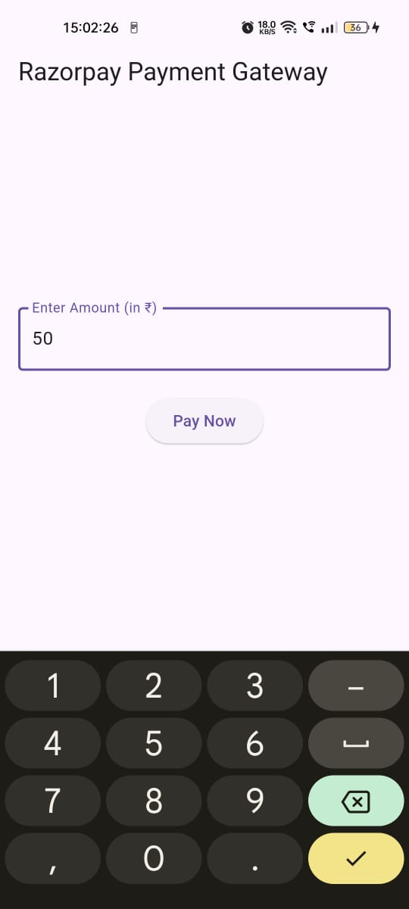
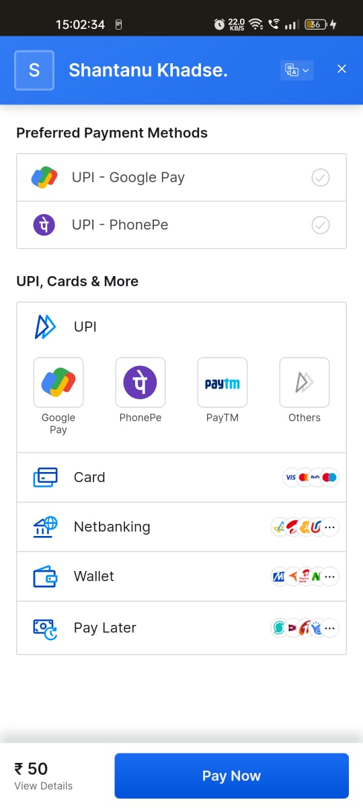

# EzPay

This Flutter application demonstrates how to integrate Razorpay's payment gateway for processing payments within a mobile app.

## 🚀 Getting Started

### Prerequisites

- Flutter SDK installed. [Get Flutter](https://flutter.dev/docs/get-started/install)
- Android/iOS emulator or a physical device connected for testing.

### 📲 Usage

- Run the application:
   - Select the device where you want to install the app 
   - Write `flutter run` in terminal, or
   - Just press F5
- The app will be opened
- Enter an amount in INR and click on "Pay Now".
- The Razorpay checkout screen will open.
- Complete the payment using available payment methods (e.g., Card, UPI, Wallets).

### ✨ Features

- **Payment Integration**: Securely process payments via Razorpay's secure checkout.
- **Feedback**: Toast messages for payment success, failure, and external wallet usage.
- **Input Validation**: Ensure valid input (amount) is entered before initiating payment.

## 🖼️ Screenshots

  
  
  

## 📧 Contact

### Shantanu Khadse
  
- GitHub: [ShantanuKH](https://github.com/ShantanuKH)
- Email: shantanukhadse784@gmail.com  
- LinkedIn: [shantanukhadse](https://www.linkedin.com/in/shantanu-khadse-a62585230/)  

